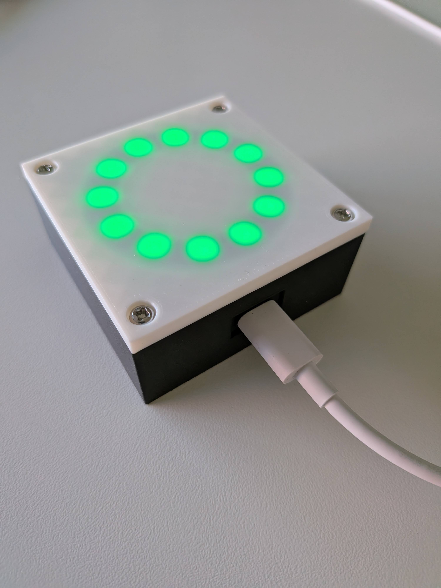
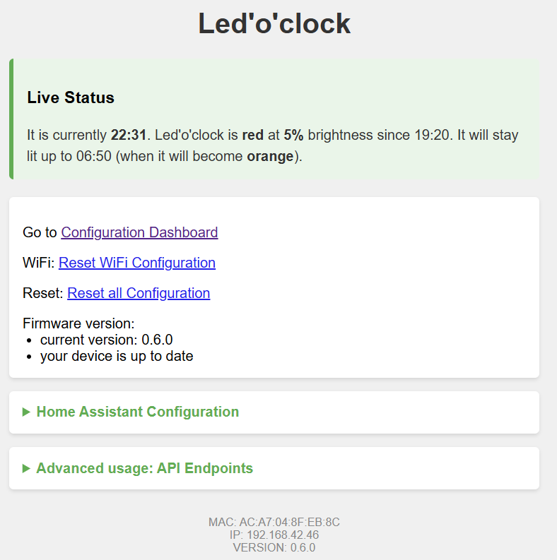
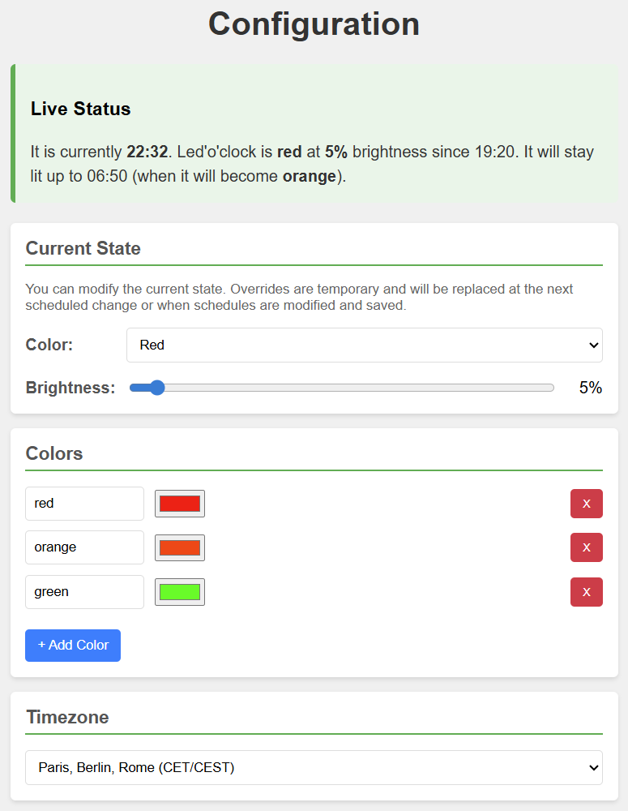
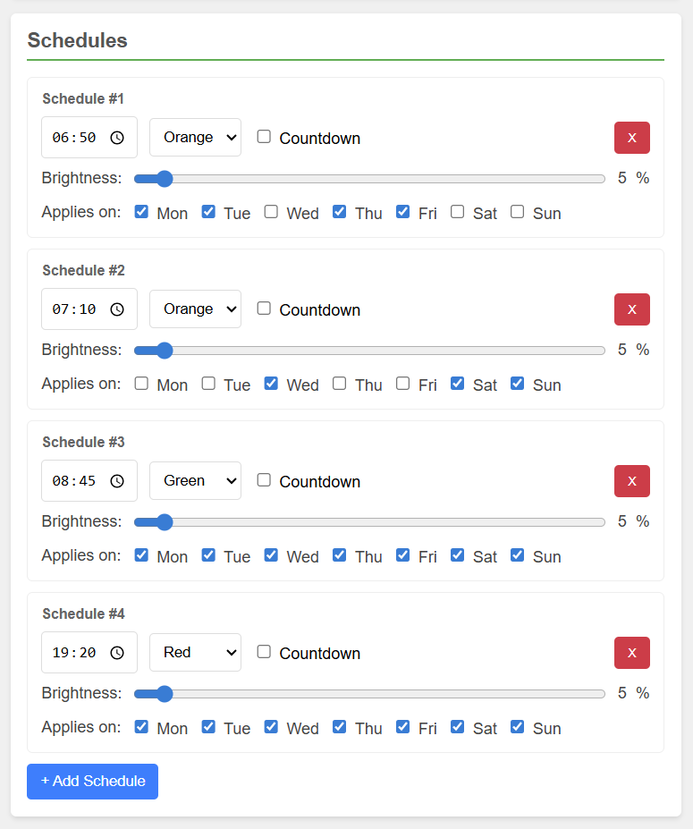

# Led'o'clock

> 🚧 WORK IN PROGRESS: This project is currently under active development. Files and documentation may change frequently.

Led'o'clock is a smart, connected, visual nightlight and time indicator designed to help kids understand when it's time to sleep, play, or wake up. 

This monorepo contains everything you need to build your own: the custom PCB, the 3D printable enclosure, and the ESP32 firmware.

## Usage

### LED Color Code

During normal operation, the ring displays the color defined in the active time slot of your schedule.

> Note that if no schedule is set, the ring will remain off. It's the initial state after configuring WiFi.

The LED ring also provides visual feedback for system events:

| Color | Meaning |
| :--- | :--- |
| 🔵 Light Blue | Device is booting and connecting to WiFi. |
| 🟡 Yellow | WiFi configuration mode — Access Point active. |
| 🟢 Green (×5 blinks) | WiFi connection successful. |
| 🟣 Purple | OTA firmware update in progress. |
| 🔴 Red (×5 blinks) | Factory Reset in progress. |

### Factory Reset

To reset the device to factory settings (wipes WiFi credentials and all configuration):

1. Hold the button on the back of the device for **5 seconds**.
2. The LED ring will start **blinking red** to confirm the reset is in progress.
3. The device restarts in Access Point mode, ready to be reconfigured.

## Features

* **Visual Time Tracking:** Uses a WS2812B LED ring to display specific colors based on the time of day.
* **Progressive Countdown:** LEDs turn off one by one to visually show how much time is left before the next scheduled event.
* **Custom Offline Schedules:** Define daily time slots with personalized hex colors and day-of-week customization. Once the initial time is synced via NTP at boot, the execution is 100% local and will continue to work perfectly even during internet outages.
* **Web Dashboard:** A standalone, mobile-friendly interface to configure the device on your local network.
* **REST API:** Fully controllable via HTTP endpoints for seamless integration with Home Assistant and other automation platforms.
* **OTA Firmware Updates:** Update the firmware over the air without physical access to the device.
* **Easy Setup:** Built-in captive portal for initial WiFi configuration.

## Web interface 

Here is the web dashboard served by the device:

Here is the configuration page, where you can set the colors, time slots, and timezone:

## Getting Started

The project is split into three main directories. Check the `README.md` inside each folder for specific instructions:

1. **`/pcb`**: KiCad schematics files to manufacture the board (designed around the ESP32-C3).
2. **`/enclosure`**: FreeCAD source file and ready-to-print STL files for the case.
3. **`/firmware`**: PlatformIO project containing the C++ source code. 

## License

**CC BY-NC-SA 4.0** (Creative Commons Attribution-NonCommercial-ShareAlike 4.0)

You are free to build, use, and modify this project for **personal use only**. 
You may **not** sell the source code, hardware files, 3D models, or the physical device itself. 
If you remix, adapt, or build upon the material, you must distribute your contributions under the **same license** as the original, credit the original author (Antoine Leveugle), and link back to this repository.

