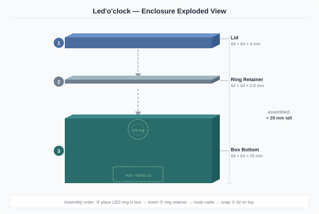
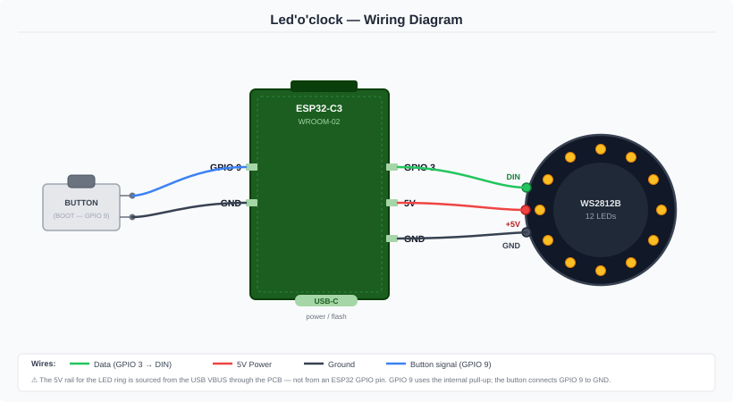

# Assembly Guide

This guide walks you through printing the enclosure, flashing the firmware, wiring the electronics, and doing the first boot of your Led'o'clock.

---

## Bill of Materials

### Electronics

| Component | Qty | Notes |
| :--- | :---: | :--- |
| ESP32-C3-WROOM-02 | 1 | With native USB-C |
| WS2812B LED ring — 12 LEDs | 1 | ~38 mm outer diameter |
| Tactile push button (6 × 6 mm) | 1 | Acts as the BOOT / Factory Reset button |
| Custom PCB | 1 | See `/pcb` folder |
| USB-C cable | 1 | For flashing and power |

### 3D Printed Parts

| Part | File | Notes |
| :--- | :--- | :--- |
| Box bottom | `ledoclock-box bottom.stl` | Main shell |
| Lid | `ledoclock-lid.stl` | ⚠ Requires supports |
| Ring retainer | `ledoclock-ring retainer.stl` | No support needed |

### Hardware

| Item | Qty | Notes |
| :--- | :---: | :--- |
| M3 heat-set inserts | 8 | 4 for the PCB pillars + 4 for closing the lid |
| M3 screws | 8 | Length to suit insert depth |

### Tools

- Soldering iron + solder (also used for heat-set inserts)
- Wire cutters / strippers
- PlatformIO IDE (VS Code extension)

---

## Step 1 — 3D Print the Enclosure

Open `enclosure/ledoclock.3mf` in **Bambu Studio** (or any slicer) and slice all three parts together.



Key settings (already saved in the `.3mf`):

| Parameter | Value |
| :--- | :--- |
| Printer | Bambu Lab P1S — 0.4 mm nozzle |
| Material | PLA |
| Layer height | 0.20 mm |
| Infill | 15 % Gyroid |
| Supports | **Lid only** — Tree (Auto) |

> Any FDM printer with a ≥ 180 × 180 mm bed works. Replicate the settings above in your slicer if you are not using Bambu Studio.

---

## Step 2 — Install the Heat-Set Inserts

Do this **while the box bottom is empty and on a flat surface**, before any electronics are installed.

Using a soldering iron set to ~200–220 °C (or the recommended temperature for your PLA brand):

**PCB pillars (4 inserts):**
1. Locate the 4 pillars inside the **box bottom** — these are the mounting points for the PCB.
2. Place one M3 heat-set insert on top of each pillar hole.
3. Press gently and vertically with the iron tip until the insert sits flush with (or just below) the surface.
4. Let cool for 30 seconds before moving the part.

**Lid closing holes (4 inserts):**
5. Locate the 4 screw holes on the **box bottom** used to close the enclosure.
6. Install the 4 remaining M3 heat-set inserts using the same technique.

> **Tip:** work slowly — too much heat will melt the surrounding plastic and weaken the hold.

---

## Step 3 — Flash the Firmware

Flash before closing the enclosure so you can see Serial output and troubleshoot easily.

### Prerequisites

- [VS Code](https://code.visualstudio.com/) + [PlatformIO extension](https://platformio.org/install/ide?install=vscode)
- USB-C cable connected to the ESP32-C3

### Steps

1. Open the `firmware/` folder in VS Code.
2. PlatformIO will automatically install all dependencies (`ArduinoJson`, `WiFiManager`, `Adafruit NeoPixel`).
3. Click **Upload** (→ arrow in the bottom toolbar), or run:

```bash
pio run --target upload
```

4. Open the Serial Monitor at **115 200 baud** to confirm a successful boot:

```bash
pio device monitor --baud 115200
```

You should see `STARTING Led'o'clock` in the console.

> **OTA updates**: once the device is on your network, future firmware updates can be triggered from the web UI via the `/firmware_update` endpoint — no cable needed.

---

## Step 4 — Wire the Electronics



### Connections

| From (ESP32-C3) | Wire colour | To (Component) |
| :--- | :---: | :--- |
| `GPIO 3` | 🟢 Green | WS2812B `DIN` |
| `5V` (USB VBUS via PCB) | 🔴 Red | WS2812B `+5V` |
| `GND` | ⚫ Black | WS2812B `GND` |
| `GPIO 9` | 🔵 Blue | Button terminal A |
| `GND` | ⚫ Black | Button terminal B |

**Notes:**
- The 5V rail for the LED ring is sourced from USB VBUS through the PCB, not from a GPIO.
- `GPIO 9` uses the ESP32-C3 internal pull-up. The button simply shorts `GPIO 9` to `GND`.
- The WS2812B uses `NEO_GRB + NEO_KHZ800` protocol (handled automatically by the Adafruit NeoPixel library).

---

## Step 5 — Assemble the Enclosure

Follow the numbered order shown in the exploded view:

**① Box bottom — mount the PCB:**
1. Place the PCB flat inside the **box bottom**, aligning it with the 4 heat-set insert pillars.
2. Fasten it with **4 M3 screws**. Do not overtighten — snug is enough for PLA.
3. Plug in the LED ring data wire from the PCB to the ring `DIN` pad.

**② LED ring + ring retainer:**
4. Place the LED ring flat on top of the PCB (or against the inner ledge near the top opening), routing the cable neatly.
5. Drop the thin **ring retainer** on top of the LED ring to lock it flush and prevent it from falling.

**③ Lid — close the enclosure:**
6. Lower the **lid** onto the box, aligning the 4 screw holes with the heat-set inserts in the box bottom.
7. Fasten with **4 M3 screws** to secure the ring retainer and lid together.

---

## Step 6 — First Boot & WiFi Setup

1. Power the device via USB-C. The ring will glow **light blue** while booting.
2. If no WiFi credentials are saved, the ring turns **yellow** and the device starts an Access Point named `Led'o'clock AP <mac>`.
3. Connect your phone or laptop to that network. A captive portal opens automatically.
4. Enter your home WiFi credentials and save. The ring will **blink green 5 times** on successful connection.
5. The device restarts and joins your network. You can now access the web UI at:

```
http://ledoclock-<mac>.local
```

> Use the **Configuration** page to set your timezone, define custom colors, and configure your weekly schedule.

---

## LED Status Reference

| Ring color | Meaning |
| :--- | :--- |
| 🔵 Light Blue | Booting / connecting to WiFi |
| 🟡 Yellow | Access Point active — waiting for WiFi config |
| 🟢 Green × 5 blinks | WiFi connected successfully |
| 🟣 Purple | OTA firmware update in progress |
| 🔴 Red × 5 blinks | Factory reset in progress |

---

## Factory Reset

Hold **GPIO 9 (BOOT button) for 5 seconds** during normal operation. The ring turns red and all settings (WiFi, schedules, colors) are wiped. The device restarts in Access Point mode.


