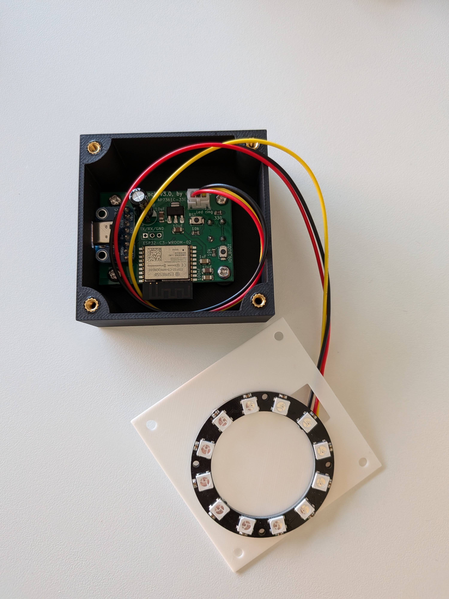
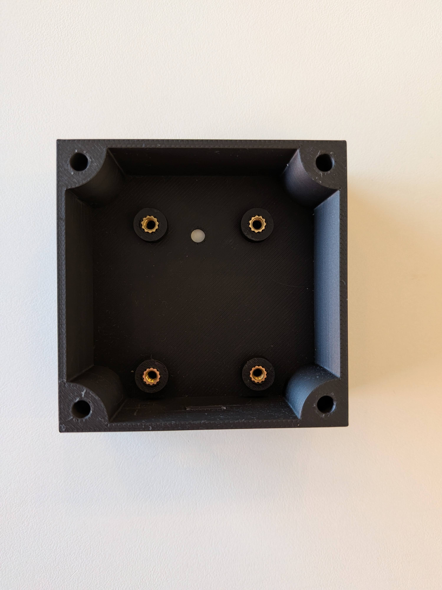
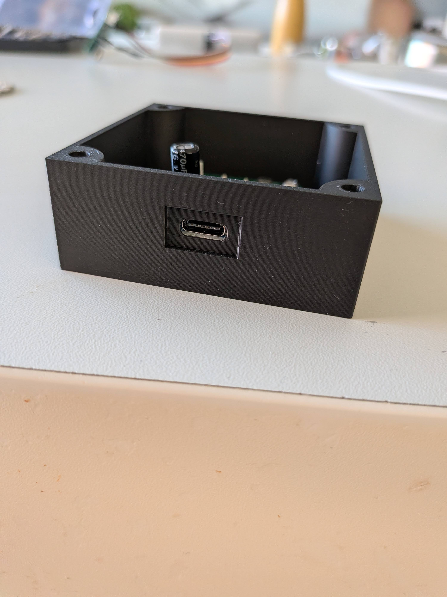

# Led'o'clock Enclosure

This folder contains the 3D printable enclosure for the Led'o'clock project. The case is designed to house the ESP32-C3 module and a 12-LED WS2812B ring, with a clean **64 × 64 mm** square footprint.

## Files

| File | Description |
| :--- | :--- |
| `ledoclock.FCStd` | FreeCAD source file — open this to modify the design. |
| `ledoclock.3mf` | Bambu Studio project file — ready to slice, includes print settings. |
| `ledoclock-box bottom.stl` | Main body: houses the PCB and the ESP32-C3. |
| `ledoclock-lid.stl` | Top lid: snaps onto the body, houses the LED ring and acts as a light diffuser frame. |
| `ledoclock-ring retainer.stl` | Thin ring retainer: keeps the LED ring flush inside the lid cavity. |

## Customization (Parametric Design)

The **`ledoclock.FCStd`** file is fully parametric. If you need to resize the box or use a different LED ring (e.g., 16 or 24 LEDs):

1. Open the file in **FreeCAD**.
2. Locate the **Spreadsheet** in the tree view.
3. Modify the aliases dimensions as you want.
4. The 3D model will update automatically.
5. Re-export the parts as STL for printing.

## Dimensions (Default)

| Part | W × D × H |
| :--- | :--- |
| Box bottom | 64 × 64 × 25 mm |
| Lid | 64 × 64 × 4 mm |
| Ring retainer | 64 × 64 × 0.8 mm |
| **Assembled** | **64 × 64 × 29 mm** |

## Recommended Print Settings

The `.3mf` file embeds all settings below and was validated on a **Bambu Lab P1S**.

| Parameter | Value |
| :--- | :--- |
| Infill | 15 % — Gyroid |
| Supports | **Lid only** — Tree (Auto) |

> Any standard FDM printer with a **≥ 180 × 180 mm** bed can print all three parts. Non-Bambu users should reproduce the settings above in their own slicer.

## Assembly Instructions

### 1. Hot-Melt Inserts
Once the `Box bottom` is printed, you need to embed brass threaded inserts into the mounting standoffs using a soldering iron. This allows the PCB to be securely mounted to the case.

* **Required hardware:** 8× `M3` brass threaded inserts.

### 2. Final Assembly
1. Seat the assembled PCB into the box bottom and secure it with 4× `M3` screws.
2. Insert the 12-LED WS2812B ring into the top `Lid`.
3. Place the `Ring retainer` behind the LED ring to keep it perfectly flush against the diffuser.
4. Plug the LED ring's cable into the JST connector on the PCB.
5. Snap the `Lid` onto the `Box bottom`.

