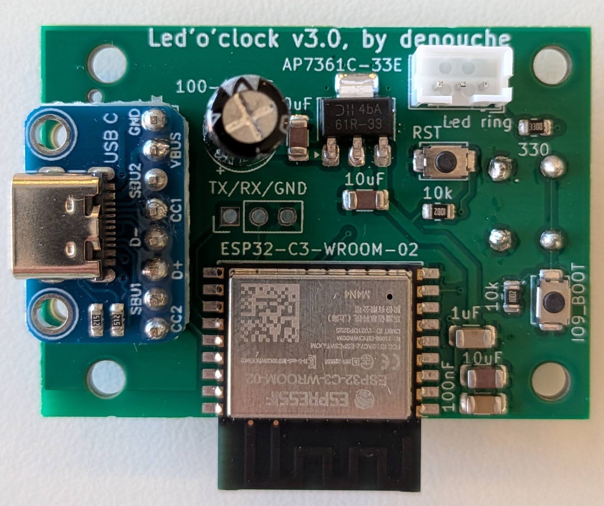
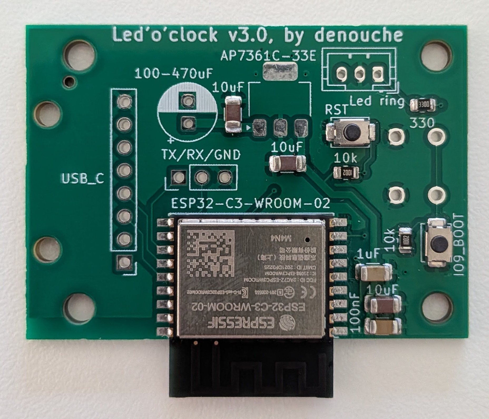
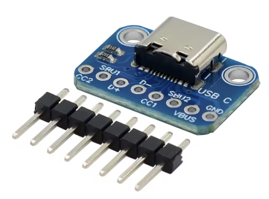

# Led'o'clock PCB

> 🚧 WORK IN PROGRESS: The v3.2 PCB design is currently being finalized. Files and documentation may change frequently.
> This v3.2 version will not require any manual soldering, as all components (including the USB-C module) are now designed for SMD assembly by JLCPCB. The documentation below still applies to the previous v3.0 version which requires some manual soldering.

This folder contains the KiCad design files, manufacturing data, and documentation for the Led'o'clock custom board.

The board is built around the **ESP32-C3** microcontroller. To optimize production costs, the surface-mount devices (SMD) are designed to be assembled by JLCPCB, but **some manual soldering is required** to complete the board.

## 1. Manufacturing (JLCPCB PCBA)

The PCB is designed for partial assembly (SMD only) using JLCPCB's "Basic" parts.

1. Go to JLCPCB and upload the Gerber archive: `jlcpcb/production_files/GERBER-led-o-clock.zip`.
2. Enable the **PCB Assembly (PCBA)** option (Top side only).
3. Upload the Bill of Materials: `jlcpcb/production_files/BOM-led-o-clock.csv`.
4. Upload the Pick and Place file: `jlcpcb/production_files/CPL-led-o-clock.csv`.

*Note: Although the through-hole components listed below have footprints and LCSC part numbers in the KiCad project, they were intentionally excluded from the automated assembly files to minimize factory setup fees.*

Here is the resulting board you should receive from the factory, with all SMD components pre-soldered:

## 2. Required Manual Soldering

Once you receive the partially assembled boards from the factory, you must manually solder the following through-hole components:

* **USB-C Module (6-pin):** A standard 6-pin USB-C female breakout board.
  ⚠️ **IMPORTANT:** The module **must** feature two **5.1kΩ pull-down resistors** on the CC1 and CC2 pins. Without these resistors, the device will NOT work with USB-C to USB-C cables or PD chargers.

  

* **JST PH 2.0 Connector (3-pin):** A horizontal female connector to plug in the LED ring.
* **Capacitor:** A 330µF electrolytic capacitor for power smoothing. *(Pay attention to the polarity!)*
* **Tactile Switch:** A 6x6mm push button. **Important:** This component must be soldered on the **BOTTOM side** of the PCB so it aligns properly with the 3D printed enclosure hole.
